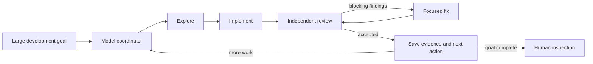

# AgenticAle: my agentic development workflow for OpenCode V2

AgenticAle is the shareable version of how I work with coding agents: the
workflows, guardrails, and reusable skills that make up my development setup
for [OpenCode V2](https://opencode.ai/v2/docs).

It currently has two layers:

- **[Autonomous Mode](#autonomous-mode)** is a complete operating mode for
  taking a large development goal through exploration, implementation,
  independent review, fixes, and a durable handoff.
- **[Skills](#skills)** are smaller, focused practices that can be used in an
  ordinary OpenCode conversation. The collection currently includes Source
  Code Lookup and Pull Request Description, with more to come.

## Autonomous Mode

Autonomous Mode is a workflow in its own right. Give it a large development
goal and it keeps a bounded explore, implement, review, and fix loop moving
until the goal is complete or it reaches a clear stop condition.

The coordinator is itself a model following an explicit process. It chooses
one verifiable slice at a time, gives each agent a focused context, enforces
budgets and review gates, and saves the evidence and next action in the
repository. There is no separate orchestration service calling model APIs or
shuffling messages between agents.



The high-volume work can run on inexpensive or local models while stronger
models are reserved for difficult implementation, independent review, and
stuck decisions. Every role is configurable, so the workflow can use the
models available through your subscriptions, providers, or local setup.

Exploration, implementation, review, fixes, and escalation are separate jobs
with separate contexts, more like a small development team than one
long-running chat.

The agent that writes a change does not mark its own work. A fresh agent
reviews the result, and blocking findings go through a focused fix and review
loop up to a configured limit. Each accepted round leaves a durable handoff so
another agent or a later session can continue without reconstructing the plan
from chat history.

## Why use Autonomous Mode?

Autonomous Mode is useful when a task is too large or too easy to lose track of
for a single chat, for example:

- adding a feature across several files;
- upgrading or refactoring an existing project;
- investigating a bug and implementing the fix;
- making a series of changes while keeping verification visible.

It is designed around a simple cost and quality strategy:

- use a fast, inexpensive, or local model for most exploration and routine
  implementation;
- use a stronger model only for difficult reasoning, independent review, or a
  stuck decision;
- keep the context for each round small, so models spend less time rereading
  the entire project;
- preserve the next action on disk, so an interrupted session does not lose the
  plan.

Nothing is pushed automatically. Autonomous Mode leaves changes in the working
tree by default. Say **commit** when you want it to create the coherent commits
for accepted work; say **create a branch**, **push**, or **open a PR** when you
want each of those separate actions. Otherwise it works on the currently
checked-out branch.

## How the workflow works

For implementation work, including a single-task goal, each task is followed
by a fresh independent review; blocking findings are sent to a focused fix
round before work advances. The coordinator keeps investigation-only work or
explicitly low-risk mechanical tasks lighter only when a full review gate would
not add useful value. The workflow records durable state in `BACKLOG.md` and
`docs/handoffs/active.md` in the project being worked on.

## Quick start

### 1. Install OpenCode first

Follow the [official OpenCode V2 installation guide](https://opencode.ai/v2/docs),
then verify that the command is available:

```sh
opencode --version
```

Confirm that this prints `opencode v2.x`. OpenCode V1 uses the same command name
but does not interpret this bundle's V2 permission rules.

The recommended installer below also needs [Node.js 20 or later](https://nodejs.org/en/download).

### 2. Install the bundle

From a checkout of this repository, run:

```sh
node scripts/install.mjs --no-model
```

Then restart OpenCode so it discovers the new command, agents, and skills.

The installer adds Autonomous Mode and the included skills to your OpenCode
user profile. It does not copy this repository's tests, documentation, scripts,
or project handoff files into the profile. The remaining steps set up
Autonomous Mode; the skills need no additional configuration.

### 3. Configure permissions for unattended Autonomous Mode

The installer leaves `opencode.jsonc` unchanged. For unattended runs, the
foreground agent must be able to launch `autonomous/*`, and child actions must
resolve as `allow` or `deny` rather than waiting for approval. Configure this
in the global file (`~/.config/opencode/opencode.jsonc`) or the project file
(`opencode.jsonc` or `.opencode/opencode.jsonc`). See the [OpenCode V2
permissions guide](https://opencode.ai/v2/docs/permissions) for the rule
syntax.

> [!WARNING]
> **Disposable coding environment only.** The example below grants broad read,
> edit, shell, and external-directory access. It can perform destructive
> actions and must not be copied unchanged onto a workstation or a host with
> valuable data. Use it only in a dedicated disposable coding environment or
> container, and adjust the rules to your environment and risk profile.

For example, an isolated container might start with:

```jsonc
{
  "$schema": "https://opencode.ai/config.json",
  "permissions": [
    { "action": "read", "resource": "*", "effect": "allow" },
    { "action": "glob", "resource": "*", "effect": "allow" },
    { "action": "grep", "resource": "*", "effect": "allow" },
    { "action": "skill", "resource": "autonomous-mode", "effect": "allow" },
    { "action": "skill", "resource": "pull-request-description", "effect": "allow" },
    { "action": "skill", "resource": "source-code-lookup", "effect": "allow" },
    { "action": "subagent", "resource": "autonomous/*", "effect": "allow" },
    { "action": "edit", "resource": "*", "effect": "allow" },
    { "action": "shell", "resource": "*", "effect": "allow" },
    { "action": "external_directory", "resource": "*", "effect": "allow" },
    { "action": "external_directory", "resource": "~/.ssh/*", "effect": "deny" },
    { "action": "external_directory", "resource": "/mnt/*", "effect": "deny" },
    { "action": "edit", "resource": "/etc/*", "effect": "deny" }
  ]
}
```

Adjust the action and folder rules to your environment, risk profile, and the
directories your work actually needs. The installed child profiles already
deny interactive questions and nested subagents.

**Approval/resume warning:** Some OpenCode V2 builds can leave a child unable
to resume after you manually approve an action. Pre-allow or pre-deny the
actions needed by child sessions; if one stalls after approval, rerun
`/autonomous` to continue from the handoff.

### 4. Start an Autonomous Mode goal

Open your project in OpenCode and run:

```text
/autonomous <describe the goal you want completed>
```

For example:

```text
/autonomous Add CSV export to the reports page, update the tests, and verify the result.
```

Use a small round budget when you want tighter control:

```text
/autonomous 3 <goal>
```

When a handoff is active, `/autonomous` resumes the next action. The default
resume budget is six worker rounds; `/autonomous 3` resumes with three.

## How planning and continuation work

Autonomous Mode manages a small operational backlog for you, but it deliberately
advances only one concrete slice at a time:

- `BACKLOG.md` is the project-level board. It holds the current milestone,
  open items, decisions that still apply, and the first active `Next slice`.
- `docs/handoffs/active.md` is the working memory for the current slice. It
  records the goal, evidence, current state, acceptance checks, and exactly one
  `NEXT` action for a fresh agent.
- Completed slice details are archived, while the backlog keeps a compact
  status and the next action. Unresolved findings become open backlog items.

This means you can use the command in three ways:

Start a new goal:

```text
/autonomous Add CSV export to the reports page, update the tests, and verify the result.
```

Continue work that was interrupted or stopped earlier:

```text
/autonomous
```

That resumes the exact `NEXT` action in `docs/handoffs/active.md`. Use
`/autonomous 3` when you want to resume with a three-worker-round budget
instead of the default six.

Start from a backlog without putting the goal in the command:

```markdown
# Project backlog

## Current milestone

Improve the reporting experience.

## Next slice

Add CSV export to the reports page and update its tests.
```

Save that as the project's `BACKLOG.md`, then run `/autonomous`. If there is no
active handoff yet, the coordinator uses the first clear `Next slice` to create
one. If an active handoff already exists, it takes precedence so unfinished
work is continued instead of starting a different backlog item.

## Choosing models: cheap by default, strong when it matters

The installer makes model routing an explicit choice. Use `--models` with a
JSON mapping so different roles can use different models, or use `--no-model`
if every role should inherit the model already active in your OpenCode
session. The latter is useful for a quick trial, but it does not provide the
workflow's intended model specialization.

If you want the workflow to use different models for different jobs, pass a
built-in preset name or a path to your own JSON file with `--models`. A preset
is only shorthand for one of the checked-in example mappings; the installer
does not probe your provider account or `/models` catalog.

| Preset | Use it when | Mapping |
| --- | --- | --- |
| `openai` | You have OpenAI connected in OpenCode | [`examples/openai.json`](examples/openai.json) |
| `zen` | You have an OpenCode Zen subscription | [`examples/gpt.json`](examples/gpt.json) |
| `local` | You have a local provider and will adapt its model IDs | [`examples/local.json`](examples/local.json) |
| `example` | You want the mixed local/strong-model template | [`examples/example.json`](examples/example.json) |

Run `/models` first and make sure the preset's IDs exist in your setup. The
`local` preset is intentionally a starting point: local provider names and
model IDs vary between machines.

### Recommended starting point: `examples/example.json`

Use the `local` preset if you can run local models, or use the `example` preset
as a mixed template that puts a cheap model on high-volume roles and reserves
a stronger model for integration review and consultation.

Open the file, replace the example model IDs with IDs shown by `/models` in
your OpenCode project, and save it as your own file, for example
`my-models.json`. Then install with:

```sh
node scripts/install.mjs --models zen
```

For a custom mapping, use a path instead:

```sh
node scripts/install.mjs --models /path/to/my-models.json
```

To explicitly install without per-role model overrides instead:

```sh
node scripts/install.mjs --no-model
```

The example is a template, not a guarantee that those exact providers or
models are configured on your machine. In particular, the `local-llama/...`
IDs require a matching local provider setup.

The intended routing looks like this:

| Role | What it does | Good default |
| --- | --- | --- |
| `explore` | Understands the project and gathers evidence | Fast, cheap, or local |
| `implement` | Makes routine changes | Fast, cheap, or local |
| `fix` | Applies specific review findings | Fast, cheap, or local |
| `implement-hard` | Handles difficult or security-sensitive work | Stronger model when needed |
| `review` | Checks a worker's changes independently | Stronger model when available |
| `deep-review` | Audits interactions across the whole slice | Best model, used sparingly |
| `consult` | Gives a second opinion on one stuck decision | Best model, used sparingly |

This split is the main reason to configure a JSON mapping: the models doing
most of the work can be inexpensive and plentiful, while expensive or
capacity-limited models are reserved for the moments where their extra
reasoning is most valuable.

If you do not have local models, use `openai` or `zen` and replace any IDs that
are not available after checking `/models`. The `gpt.json` file is the
provider-specific template behind the `zen` preset.

### JSON format

You may assign only the roles you want to override; omitted roles continue to
inherit the active session model:

```json
{
  "explore": "cheap-provider/fast-model",
  "implement": "cheap-provider/fast-model",
  "fix": "cheap-provider/fast-model",
  "review": "strong-provider/review-model",
  "deep-review": "strong-provider/best-model",
  "consult": "strong-provider/best-model"
}
```

Model IDs use OpenCode's `provider/model[#variant]` format. Run `/models` to
see what your connected providers actually make available.

## Skills

Skills capture smaller, reusable parts of how I work. They are installed
alongside Autonomous Mode, but each can be used independently in a normal
OpenCode conversation. This is a growing collection; the repository currently
includes the following two skills.

### Source Code Lookup

The [`source-code-lookup` skill](skills/source-code-lookup/SKILL.md) traces
behavior across repository boundaries. It uses clues such as package references,
API endpoints, and message names to identify the codebase that owns the behavior,
then searches local checkouts and, when needed, upstream source repositories.
When a matching revision is known, it inspects that revision.

Use it directly in a normal OpenCode task, for example:

```text
Use the source-code-lookup skill to find the service that publishes this message and explain where its payload is built.
```

The skill searches `~/dev` for existing checkouts by default. You can set a
different root with the installer's `--source-root` option, described under
[Useful installer commands](#useful-installer-commands).

### Pull Request Description

Use the [`pull-request-description` skill](skills/pull-request-description/SKILL.md)
when drafting or revising a PR body. It is a writing convention, not a GitHub
automation workflow: it does not create branches, commits, pushes, or pull
requests.

The skill keeps the summary short, then focuses on why the change exists, its
goal, relevant operational or deployment notes, and unresolved limitations or
gotchas. It avoids narrating obvious line-by-line implementation details.
Ordinary automated-test results are omitted; mention validation only when a
manual check, special environment, or non-obvious verification is useful to a
reviewer.

## Useful installer commands

The source lookup skill searches `~/dev` for existing checkouts by default.
For a different local repository root, use a copy install with
`--source-root`:

```sh
node scripts/install.mjs --no-model --source-root /path/to/repos
```

The installer writes that path into the installed skill. Reinstalling with a
different path requires `--replace`, which backs up the previous copy.
Linked installs use the checked-in `~/dev` default and cannot use
`--source-root`.

The default profile target is `$XDG_CONFIG_HOME/opencode` when
`XDG_CONFIG_HOME` is set, otherwise `~/.config/opencode`. Use `--target` for a
different or isolated profile:

```sh
node scripts/install.mjs --target /path/to/opencode --no-model
```

The install command requires either `--models PATH|PRESET` or `--no-model`.

Preview changes without touching the filesystem:

```sh
node scripts/install.mjs --dry-run --no-model
```

Update an existing installation after fetching a newer version (using explicit
session-model inheritance here):

```sh
node scripts/install.mjs --replace --no-model
```

Uninstall only the files owned by this package:

```sh
node scripts/install.mjs uninstall
```

The installer records its ownership, refuses to overwrite differing files by
default, and creates a timestamped backup before an explicitly approved
replacement. Modified files are preserved during uninstall.

## Troubleshooting

- **`/autonomous` is not found:** restart OpenCode after running the installer.
- **A worker stops for approval or does not resume:** review the permission
  setup above. Child sessions need deterministic `allow`/`deny` rules for the
  actions they use; rerun `/autonomous` to continue from the handoff after a
  stalled child.
- **A model cannot be found:** run `/models`, replace the unavailable ID in your
  JSON file, and reinstall with `--replace`.
- **You are unsure about model routing:** use `--no-model` for a quick trial,
  then reinstall with `--models /path/to/my-models.json` when you are ready to
  specialize roles.
- **You want to understand the implementation:** read the optional
  [technical architecture guide](docs/architecture.md).

## Limitations

- Only OpenCode V2 is supported and tested in this release.
- A fresh child context provides independence, but it does not automatically
  mean a different model family; use `--models` for explicit model separation.
- Prompt instructions complement OpenCode permissions; they cannot make an
  inherently irreversible operation safe.
- Unattended operation still needs bounded budgets and final human inspection.

## For contributors

Run the dependency-free checks:

```sh
node scripts/validate.mjs
node scripts/test-installer.mjs
```

See [CONTRIBUTING.md](CONTRIBUTING.md) before proposing changes. This project is
available under the [MIT License](LICENSE).
