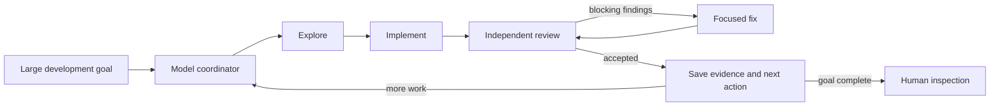

# Autonomous Mode: durable project work

Use `/work` for everyday tasks. Autonomous Mode is the advanced workflow for
projects and milestones that must continue across many rounds and fresh sessions.
See the [quick start](../README.md) for installation.

## Autonomous Mode

Autonomous Mode is a workflow in its own right. Give it a large development
goal and it keeps a bounded explore, implement, review, and fix loop moving
until the goal is complete or it reaches a clear stop condition.

The coordinator is itself a model following an explicit process. It chooses
one verifiable slice at a time, gives each agent a focused context, enforces
budgets and review gates, and saves the evidence and next action in the
repository. There is no separate orchestration service calling model APIs or
shuffling messages between agents.



The high-volume work can run on inexpensive or local models while stronger
models are reserved for difficult implementation, independent review, and
stuck decisions. Every role is configurable, so the workflow can use the
models available through your subscriptions, providers, or local setup.

Exploration, implementation, review, fixes, and escalation are separate jobs
with separate contexts, more like a small development team than one
long-running chat.

The agent that writes a change does not mark its own work. A fresh agent
reviews the result, and blocking findings go through a focused fix and review
loop up to a configured limit. Each accepted round leaves a durable handoff so
another agent or a later session can continue without reconstructing the plan
from chat history.

## Why use Autonomous Mode?

Autonomous Mode is useful when a task is too large or too easy to lose track of
for a single chat, for example:

- adding a feature across several files;
- upgrading or refactoring an existing project;
- investigating a bug and implementing the fix;
- making a series of changes while keeping verification visible.

It is designed around a simple cost and quality strategy:

- use a fast, inexpensive, or local model for most exploration and routine
  implementation;
- use a stronger model only for difficult reasoning, independent review, or a
  stuck decision;
- keep the context for each round small, so models spend less time rereading
  the entire project;
- preserve the next action on disk, so an interrupted session does not lose the
  plan.

Nothing is pushed automatically. Autonomous Mode leaves changes in the working
tree by default. Say **commit** when you want it to create the coherent commits
for accepted work; say **create a branch**, **push**, or **open a PR** when you
want each of those separate actions. Otherwise it works on the currently
checked-out branch.

## How the workflow works

For implementation work, including a single-task goal, each task is followed
by a fresh independent review; blocking findings are sent to a focused fix
round before work advances. The coordinator keeps investigation-only work or
explicitly low-risk mechanical tasks lighter only when a full review gate would
not add useful value. The workflow records durable state in `BACKLOG.md` and
`docs/handoffs/active.md` in the project being worked on.

## Permissions for unattended runs

The installer leaves `opencode.jsonc` unchanged. For unattended runs, the
foreground agent must be able to launch `autonomous/*`, and child actions must
resolve as `allow` or `deny` rather than waiting for approval. Configure this
in the global file (`~/.config/opencode/opencode.jsonc`) or the project file
(`opencode.jsonc` or `.opencode/opencode.jsonc`). See the [OpenCode V2
permissions guide](https://opencode.ai/v2/docs/permissions) for the rule
syntax.

> [!WARNING]
> **Disposable coding environment only.** The example below grants broad read,
> edit, shell, and external-directory access. It can perform destructive
> actions and must not be copied unchanged onto a workstation or a host with
> valuable data. Use it only in a dedicated disposable coding environment or
> container, and adjust the rules to your environment and risk profile.

For example, an isolated container might start with:

```jsonc
{
  "$schema": "https://opencode.ai/config.json",
  "permissions": [
    { "action": "read", "resource": "*", "effect": "allow" },
    { "action": "glob", "resource": "*", "effect": "allow" },
    { "action": "grep", "resource": "*", "effect": "allow" },
    { "action": "skill", "resource": "autonomous-mode", "effect": "allow" },
    { "action": "skill", "resource": "pull-request-description", "effect": "allow" },
    { "action": "skill", "resource": "source-code-lookup", "effect": "allow" },
    { "action": "subagent", "resource": "autonomous/*", "effect": "allow" },
    { "action": "edit", "resource": "*", "effect": "allow" },
    { "action": "shell", "resource": "*", "effect": "allow" },
    { "action": "external_directory", "resource": "*", "effect": "allow" },
    { "action": "external_directory", "resource": "~/.ssh/*", "effect": "deny" },
    { "action": "external_directory", "resource": "/mnt/*", "effect": "deny" },
    { "action": "edit", "resource": "/etc/*", "effect": "deny" }
  ]
}
```

Adjust the action and folder rules to your environment, risk profile, and the
directories your work actually needs. The installed child profiles already
deny interactive questions and nested subagents.

**Approval/resume warning:** Some OpenCode V2 builds can leave a child unable
to resume after you manually approve an action. Pre-allow or pre-deny the
actions needed by child sessions; if one stalls after approval, rerun
`/autonomous` to continue from the handoff.

## Start or resume a goal

Open your project in OpenCode and run:

```text
/autonomous <describe the goal you want completed>
```

For example:

```text
/autonomous Add CSV export to the reports page, update the tests, and verify the result.
```

Use a small round budget when you want tighter control:

```text
/autonomous 3 <goal>
```

When a handoff is active, `/autonomous` resumes the next action. The default
resume budget is six worker rounds; `/autonomous 3` resumes with three.

## How planning and continuation work

Autonomous Mode manages a small operational backlog for you, but it deliberately
advances only one concrete slice at a time:

- `BACKLOG.md` is the project-level board. It holds the current milestone,
  open items, decisions that still apply, and the first active `Next slice`.
- `docs/handoffs/active.md` is the working memory for the current slice. It
  records the goal, evidence, current state, acceptance checks, and exactly one
  `NEXT` action for a fresh agent.
- Completed slice details are archived, while the backlog keeps a compact
  status and the next action. Unresolved findings become open backlog items.

This means you can use the command in three ways:

Start a new goal:

```text
/autonomous Add CSV export to the reports page, update the tests, and verify the result.
```

Continue work that was interrupted or stopped earlier:

```text
/autonomous
```

That resumes the exact `NEXT` action in `docs/handoffs/active.md`. Use
`/autonomous 3` when you want to resume with a three-worker-round budget
instead of the default six.

Start from a backlog without putting the goal in the command:

```markdown
# Project backlog

## Current milestone

Improve the reporting experience.

## Next slice

Add CSV export to the reports page and update its tests.
```

Save that as the project's `BACKLOG.md`, then run `/autonomous`. If there is no
active handoff yet, the coordinator uses the first clear `Next slice` to create
one. If an active handoff already exists, it takes precedence so unfinished
work is continued instead of starting a different backlog item.

## Copilot entry point

Select **AgenticAle Autonomous** in the agent picker, or start:

```sh
copilot --agent agenticale:agenticale-autonomous
```

Then describe the goal. `/agenticale:autonomous 3 <goal>` supplies an optional
worker-round budget; `/agenticale:autonomous` resumes the active handoff. Select
the coordinator first: a slash command supplies instructions to the current
agent and does not switch its model or agent profile. The everyday **AgenticAle**
coordinator uses session state instead and does not resume autonomous work.

## Review and persistence

Independent review remains the default for changes. The existing standard mode
is retained for investigation-only work or explicitly accepted mechanical work
without an independent review. Accepted slices, open findings, and session
closure remain durable under the existing handoff and archival policy.

Working-tree persistence is the default. Ask for commits when desired. Branch
creation, pushing, and opening a PR remain separate explicit requests in this
advanced workflow; `/work --pr` provides the bundled everyday delivery endpoint.

The coordinator records read-only exploration and consultation reports on disk;
read-only children never need edit permission to preserve their findings.
